cm007 Exercises: Exploring Aesthetic Mappings
================

Beyond the x and y aesthetics
=============================

Switch focus to exploring aesthetic mappings, instead of geoms.

``` r
library(tidyverse)
```

    ## ── Attaching packages ──────────────────────────────────────────────────────────────────────── tidyverse 1.2.1 ──

    ## ✔ ggplot2 2.2.1     ✔ purrr   0.2.4
    ## ✔ tibble  1.4.2     ✔ dplyr   0.7.4
    ## ✔ tidyr   0.8.1     ✔ stringr 1.3.0
    ## ✔ readr   1.1.1     ✔ forcats 0.3.0

    ## Warning: package 'ggplot2' was built under R version 3.3.2

    ## Warning: package 'readr' was built under R version 3.3.2

    ## Warning: package 'purrr' was built under R version 3.3.2

    ## Warning: package 'dplyr' was built under R version 3.3.2

    ## ── Conflicts ─────────────────────────────────────────────────────────────────────────── tidyverse_conflicts() ──
    ## ✖ dplyr::filter() masks stats::filter()
    ## ✖ dplyr::lag()    masks stats::lag()

``` r
library(gapminder)
```

    ## Warning: package 'gapminder' was built under R version 3.3.2

Shapes
------

-   Try a scatterplot of `gdpPercap` vs `pop` with a categorical variable (continent) as `shape`.

``` r
gvsl <- ggplot(gapminder, aes(gdpPercap, lifeExp)) +
  scale_x_log10()
gvsl + geom_point(aes(shape=continent), alpha=0.2)
```

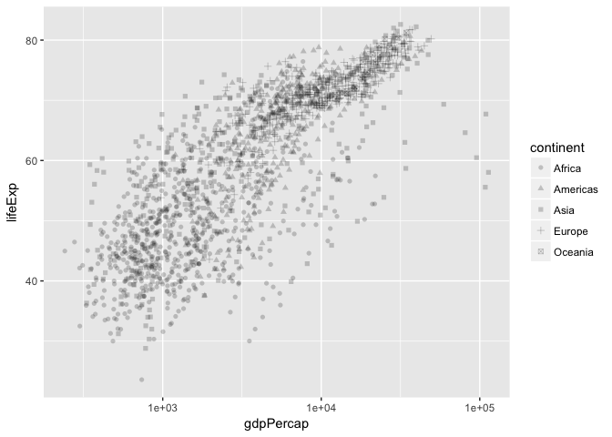

-   As with all (?) aesthetics, we can also have them *not* as aesthetics!
    -   Try some shapes: first as integer from 0-24, then as keyboard characters.
    -   What's up with `pch`?

``` r
gvsl + geom_point(shape=7)
```


``` r
gvsl + geom_point(pch=7)
```

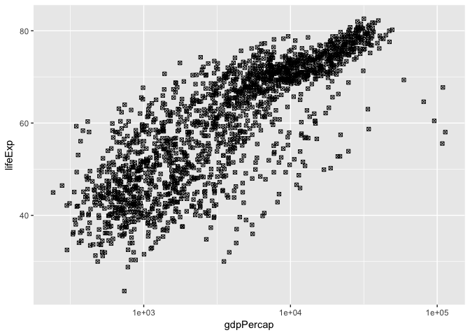

``` r
gvsl + geom_point(shape="$")
```

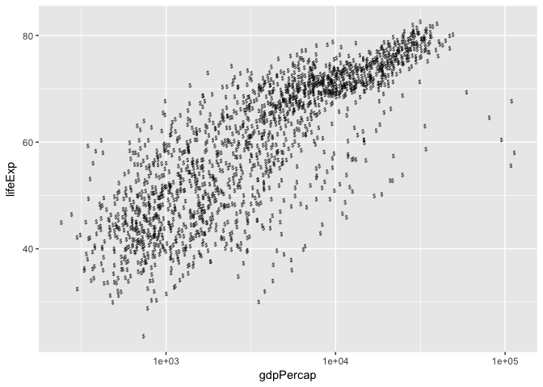

List of shapes can be found [at the bottom of the `scale_shape` documentation](https://ggplot2.tidyverse.org/reference/scale_shape.html).

Colour
------

Make a scatterplot. Then:

-   Try colour as categorical variable.

``` r
gvsl + geom_point(aes(colour=continent))
```


-   Try `colour` and `color`.
-   Try colour as numeric variable

``` r
gvsl + geom_point(aes(colour=pop))
```

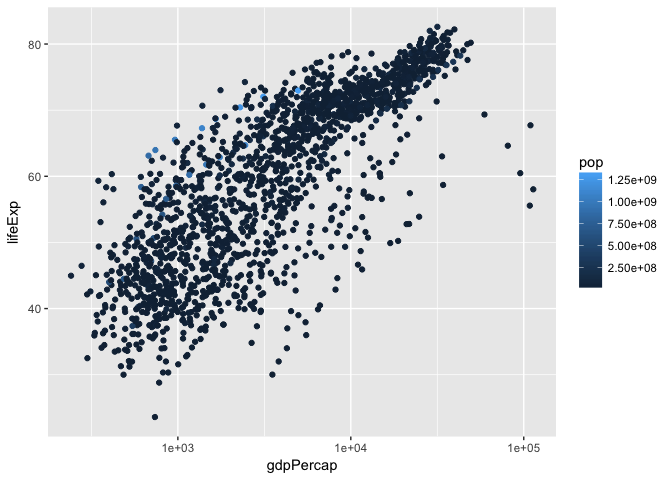

    - Try `trans="log10"` for log scale.

``` r
gvsl + geom_point(aes(colour=pop)) + scale_color_continuous(trans="log10")
```


``` r
gvsl + geom_point(aes(colour=lifeExp > 60))
```

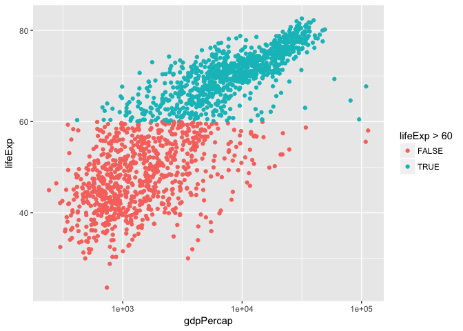

Make a line plot of `gdpPercap` over time for all countries. Colour by `lifeExp > 60` (remember that `lifeExp` looks bimodal?)

Try adding colour to a histogram. How is this different?

``` r
ggplot(gapminder, aes(lifeExp)) +
  geom_histogram(aes(colour=continent))
```

    ## `stat_bin()` using `bins = 30`. Pick better value with `binwidth`.

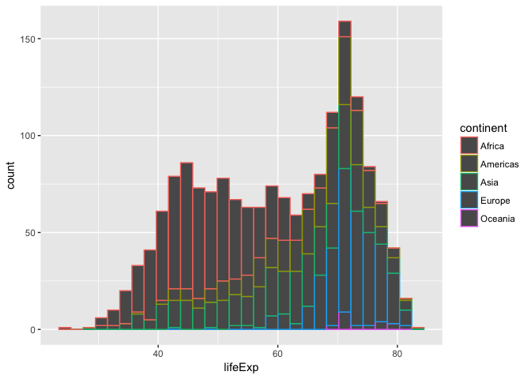

``` r
ggplot(gapminder, aes(lifeExp)) +
  geom_histogram(aes(fill=continent)) # overplotting, trying to put too much information on a plot 
```

    ## `stat_bin()` using `bins = 30`. Pick better value with `binwidth`.

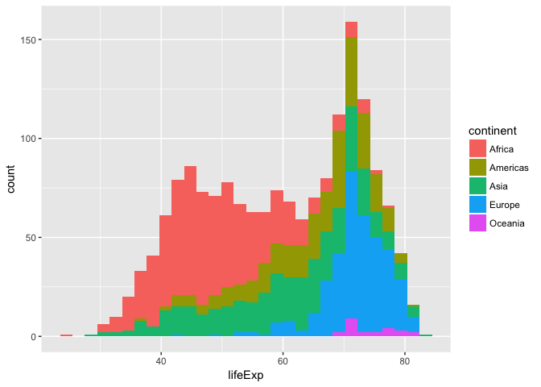 \#\# Facetting

Make histograms of `gdpPercap` for each continent. Try the `scales` and `ncol` arguments.

``` r
ggplot(gapminder, aes(lifeExp)) +
  facet_wrap(~ continent, scales = "free_x") + #free_x is for them to have their own x-axis
  geom_histogram(aes(colour=continent))
```

    ## `stat_bin()` using `bins = 30`. Pick better value with `binwidth`.

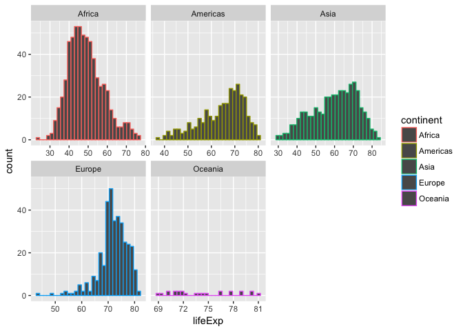

Remove Oceania. Add another variable: `lifeExp > 60`.

``` r
ggplot(gapminder, aes(lifeExp)) +
  facet_grid(continent ~ lifeExp > 60) + 
  geom_histogram()
```

    ## `stat_bin()` using `bins = 30`. Pick better value with `binwidth`.

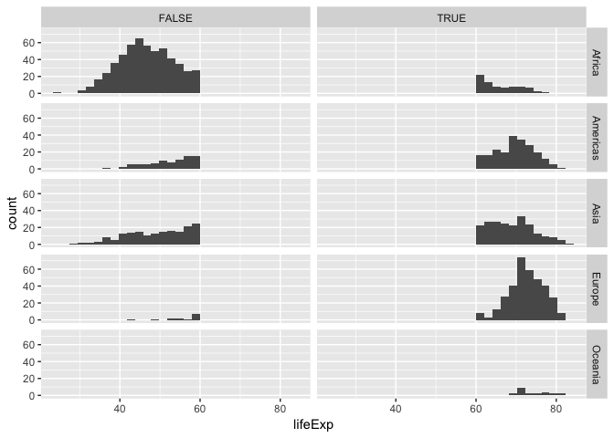

Bubble Plots
------------

``` r
gvsl + geom_point(aes(size=pop), alpha=0.2) +
  scale_size_area()
```

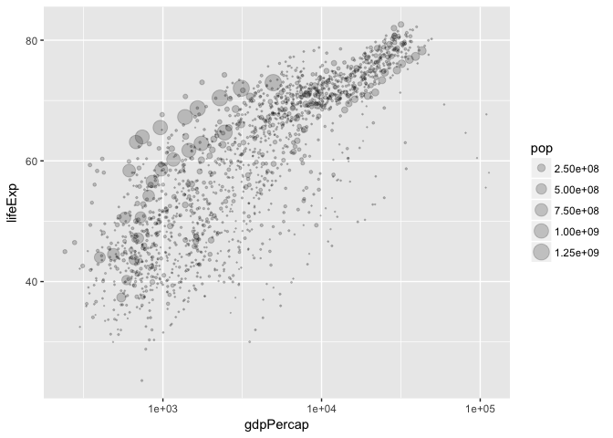

-   Add a `size` aesthetic to a scatterplot. What about `cex`?
-   Try adding `scale_radius()` and `scale_size_area()`. What's better?
-   Use `shape=21` to distinguish between `fill` (interior) and `colour` (exterior).

``` r
gvsl + geom_point(aes(size=pop, fill=continent), shape=21, colour="black", alpha=0.2) 
```

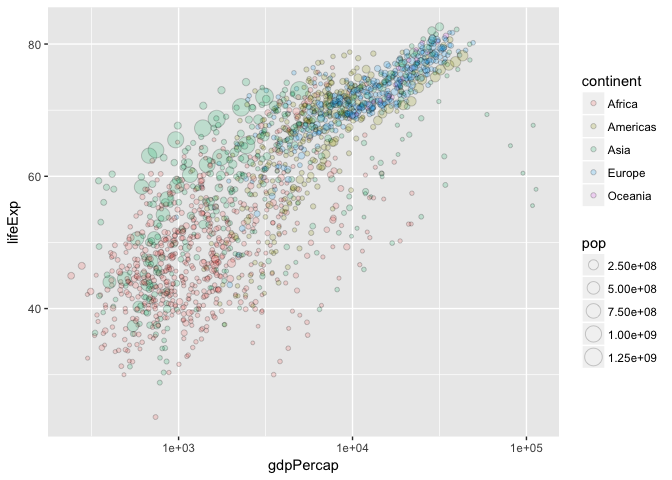

"Complete" plot
---------------

Let's try plotting much of the data.

-   gdpPercap vs lifeExp with pop bubbles
-   facet by year
-   colour by continent

``` r
gvsl + geom_point(aes(size=pop, colour=continent)) +
  scale_size_area() +
  facet_wrap(~ year)
```

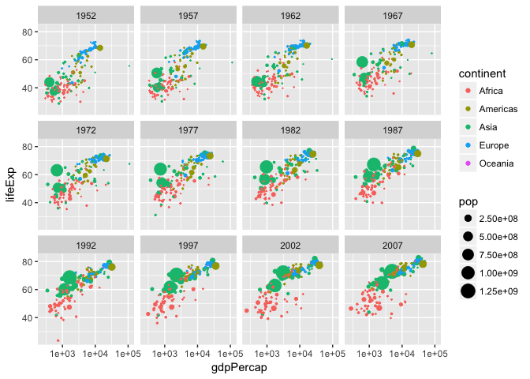

``` r
gvsl + geom_point(aes(size=lifeExp, colour=continent)) +
  scale_size_area() +
  facet_wrap(~ year)
```

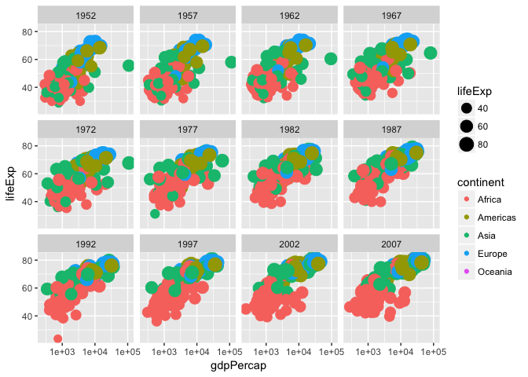

Continue from last time (geom exploration with `x` and `y` aesthetics)
======================================================================

Path plots
----------

Let's see how Rwanda's life expectancy and GDP per capita have evolved over time, using a path plot.

-   Try `geom_line()`. Try `geom_point()`.
-   Add `arrow=arrow()` option.
-   Add `geom_text`, with year label.

``` r
gapminder %>%
  filter(country == "Rwanda") %>%
  arrange(year) %>%
  ggplot(aes(gdpPercap, lifeExp)) +
  #scale_x_log10() +
  geom_point() +
  geom_path(arrow = arrow())
```

    ## Warning: package 'bindrcpp' was built under R version 3.3.2

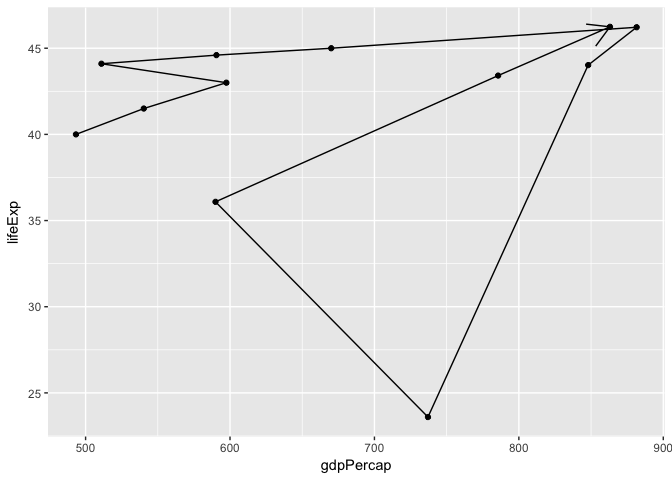

Two categorical variables
-------------------------

Try `cyl` (number of cylinders) ~ `am` (transmission) in the `mtcars` data frame.

-   Scatterplot? Jitterplot? No.
-   `geom_count()`.
-   `geom_bin2d()`. Compare with `geom_tile()` with `fill` aes.

``` r
head(mtcars)
```

    ##                    mpg cyl disp  hp drat    wt  qsec vs am gear carb
    ## Mazda RX4         21.0   6  160 110 3.90 2.620 16.46  0  1    4    4
    ## Mazda RX4 Wag     21.0   6  160 110 3.90 2.875 17.02  0  1    4    4
    ## Datsun 710        22.8   4  108  93 3.85 2.320 18.61  1  1    4    1
    ## Hornet 4 Drive    21.4   6  258 110 3.08 3.215 19.44  1  0    3    1
    ## Hornet Sportabout 18.7   8  360 175 3.15 3.440 17.02  0  0    3    2
    ## Valiant           18.1   6  225 105 2.76 3.460 20.22  1  0    3    1

``` r
ggplot(mtcars, aes(cyl, am)) +
  geom_point() +
  geom_count()
```

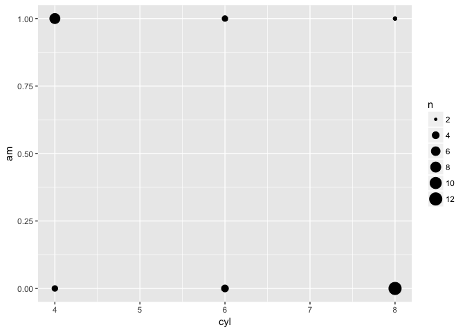

``` r
ggplot(mtcars, aes(factor(cyl), factor(am))) +
  geom_bin2d()
```

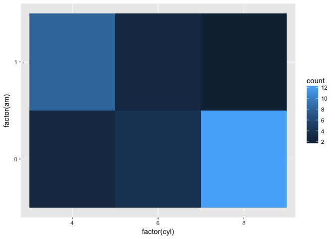 \#\# Overplotting

Try a scatterplot with:

-   Alpha transparency.
-   `geom_hex()`
-   `geom_density2d()`
-   `geom_smooth()`

``` r
gvsl + geom_hex()
```

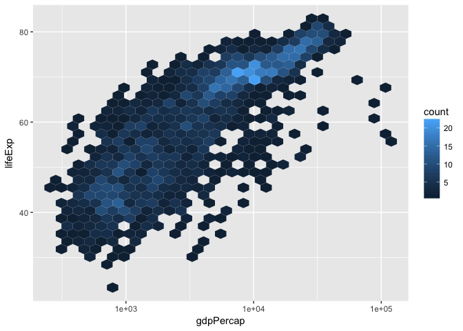

``` r
gvsl + geom_density2d()
```

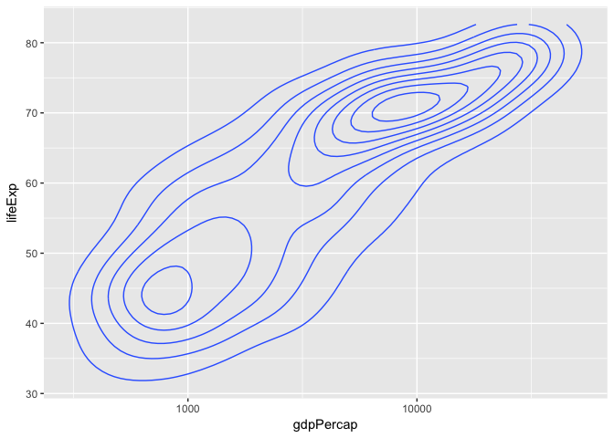

``` r
gvsl + geom_point(alpha=0.1) + geom_smooth(method="lm")
```

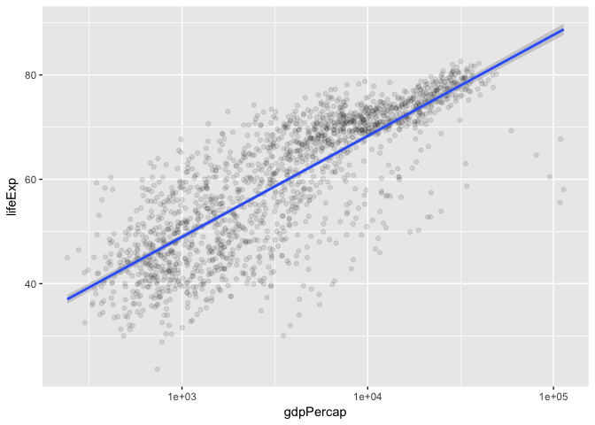

Bar plots
---------

How many countries are in each continent? Use the year 2007.

1.  After filtering the gapminder data to 2007, make a bar chart of the number of countries in each continent. Store everything except the geom in the variable `d`.

``` r
gapminder %>%
  filter(year == 2007) %>%
  ggplot(aes(x=continent)) +
  geom_bar()
```

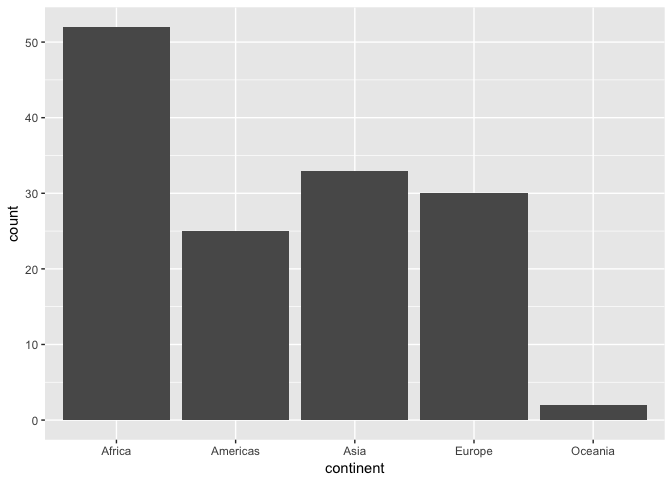

1.  Notice the y-axis. Oddly, `ggplot2` doesn't make it obvious how to change to proportion. Try adding a `y` aesthetic: `y=..count../sum(..count..)`.

**Uses of bar plots**: Get a sense of relative quantities of categories, or see the probability mass function of a categorical random variable.

Polar coordinates
-----------------

-   Add `coord_polar()` to a scatterplot.

``` r
gvsl + geom_point() + coord_polar()
```

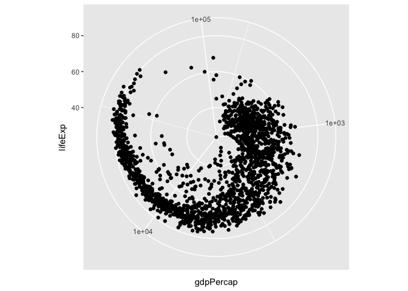

Want more practice?
===================

If you'd like some practice, give these exercises a try

**Exercise 1**: Make a plot of `year` (x) vs `lifeExp` (y), with points coloured by continent. Then, to that same plot, fit a straight regression line to each continent, without the error bars. If you can, try piping the data frame into the `ggplot` function.

**Exercise 2**: Repeat Exercise 1, but switch the *regression line* and *geom\_point* layers. How is this plot different from that of Exercise 1?

**Exercise 3**: Omit the `geom_point` layer from either of the above two plots (it doesn't matter which). Does the line still show up, even though the data aren't shown? Why or why not?

**Exercise 4**: Make a plot of `year` (x) vs `lifeExp` (y), facetted by continent. Then, fit a smoother through the data for each continent, without the error bars. Choose a span that you feel is appropriate.

**Exercise 5**: Plot the population over time (year) using lines, so that each country has its own line. Colour by `gdpPercap`. Add alpha transparency to your liking.

**Exercise 6**: Add points to the plot in Exercise 5.
