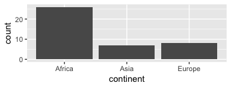
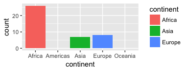
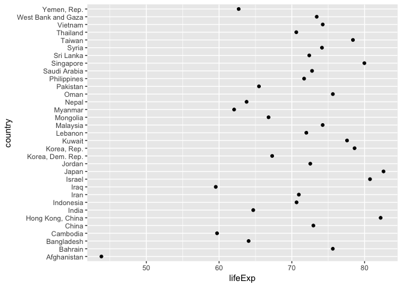
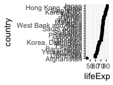
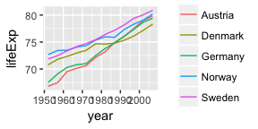
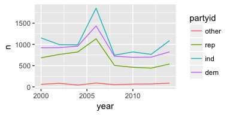

cm012 Exercises: Factors
================

`forcats` package comes loaded with `tidyverse`:

``` r
suppressPackageStartupMessages(library(tidyverse))
```

    ## Warning: package 'ggplot2' was built under R version 3.3.2

    ## Warning: package 'readr' was built under R version 3.3.2

    ## Warning: package 'purrr' was built under R version 3.3.2

    ## Warning: package 'dplyr' was built under R version 3.3.2

``` r
library(gapminder)
```

    ## Warning: package 'gapminder' was built under R version 3.3.2

Factors
=======

Resources
---------

-   Exercises are based on <http://stat545.com/block029_factors.html> and <http://r4ds.had.co.nz/factors.html>. Some content was taken from the former.

Intro to Factors
----------------

What is a factor? A "truly categorical" variable. You can think of it as a vector that:

-   has character entries on the surface
-   are integers underneath
-   has **levels**

Examples of Base R's obsession with coercing to factors:

``` r
data.frame(x=c("A", "B")) %>% 
  str()
```

    ## 'data.frame':    2 obs. of  1 variable:
    ##  $ x: Factor w/ 2 levels "A","B": 1 2

``` r
lotr1 <- "https://raw.githubusercontent.com/jennybc/lotr-tidy/master/data/The_Fellowship_Of_The_Ring.csv" %>% 
  read.csv()
lotr2 <- "https://raw.githubusercontent.com/jennybc/lotr-tidy/master/data/The_Return_Of_The_King.csv" %>% 
  read.csv()
lotr1
```

    ##                         Film   Race Female Male
    ## 1 The Fellowship Of The Ring    Elf   1229  971
    ## 2 The Fellowship Of The Ring Hobbit     14 3644
    ## 3 The Fellowship Of The Ring    Man      0 1995

``` r
lotr2
```

    ##                     Film   Race Female Male
    ## 1 The Return Of The King    Elf    183  510
    ## 2 The Return Of The King Hobbit      2 2673
    ## 3 The Return Of The King    Man    268 2459

``` r
str(lotr1)
```

    ## 'data.frame':    3 obs. of  4 variables:
    ##  $ Film  : Factor w/ 1 level "The Fellowship Of The Ring": 1 1 1
    ##  $ Race  : Factor w/ 3 levels "Elf","Hobbit",..: 1 2 3
    ##  $ Female: int  1229 14 0
    ##  $ Male  : int  971 3644 1995

``` r
str(lotr2)
```

    ## 'data.frame':    3 obs. of  4 variables:
    ##  $ Film  : Factor w/ 1 level "The Return Of The King": 1 1 1
    ##  $ Race  : Factor w/ 3 levels "Elf","Hobbit",..: 1 2 3
    ##  $ Female: int  183 2 268
    ##  $ Male  : int  510 2673 2459

Examples of problems encountered with factors. (ideas came from [R Bloggers](https://www.r-bloggers.com/factors-are-not-first-class-citizens-in-r/))

``` r
head(iris)
```

    ##   Sepal.Length Sepal.Width Petal.Length Petal.Width Species
    ## 1          5.1         3.5          1.4         0.2  setosa
    ## 2          4.9         3.0          1.4         0.2  setosa
    ## 3          4.7         3.2          1.3         0.2  setosa
    ## 4          4.6         3.1          1.5         0.2  setosa
    ## 5          5.0         3.6          1.4         0.2  setosa
    ## 6          5.4         3.9          1.7         0.4  setosa

``` r
iris %>% 
  mutate(Species = ifelse(Species == "versicolor", "vers", Species))
```

    ## Warning: package 'bindrcpp' was built under R version 3.3.2

    ##     Sepal.Length Sepal.Width Petal.Length Petal.Width Species
    ## 1            5.1         3.5          1.4         0.2       1
    ## 2            4.9         3.0          1.4         0.2       1
    ## 3            4.7         3.2          1.3         0.2       1
    ## 4            4.6         3.1          1.5         0.2       1
    ## 5            5.0         3.6          1.4         0.2       1
    ## 6            5.4         3.9          1.7         0.4       1
    ## 7            4.6         3.4          1.4         0.3       1
    ## 8            5.0         3.4          1.5         0.2       1
    ## 9            4.4         2.9          1.4         0.2       1
    ## 10           4.9         3.1          1.5         0.1       1
    ## 11           5.4         3.7          1.5         0.2       1
    ## 12           4.8         3.4          1.6         0.2       1
    ## 13           4.8         3.0          1.4         0.1       1
    ## 14           4.3         3.0          1.1         0.1       1
    ## 15           5.8         4.0          1.2         0.2       1
    ## 16           5.7         4.4          1.5         0.4       1
    ## 17           5.4         3.9          1.3         0.4       1
    ## 18           5.1         3.5          1.4         0.3       1
    ## 19           5.7         3.8          1.7         0.3       1
    ## 20           5.1         3.8          1.5         0.3       1
    ## 21           5.4         3.4          1.7         0.2       1
    ## 22           5.1         3.7          1.5         0.4       1
    ## 23           4.6         3.6          1.0         0.2       1
    ## 24           5.1         3.3          1.7         0.5       1
    ## 25           4.8         3.4          1.9         0.2       1
    ## 26           5.0         3.0          1.6         0.2       1
    ## 27           5.0         3.4          1.6         0.4       1
    ## 28           5.2         3.5          1.5         0.2       1
    ## 29           5.2         3.4          1.4         0.2       1
    ## 30           4.7         3.2          1.6         0.2       1
    ## 31           4.8         3.1          1.6         0.2       1
    ## 32           5.4         3.4          1.5         0.4       1
    ## 33           5.2         4.1          1.5         0.1       1
    ## 34           5.5         4.2          1.4         0.2       1
    ## 35           4.9         3.1          1.5         0.2       1
    ## 36           5.0         3.2          1.2         0.2       1
    ## 37           5.5         3.5          1.3         0.2       1
    ## 38           4.9         3.6          1.4         0.1       1
    ## 39           4.4         3.0          1.3         0.2       1
    ## 40           5.1         3.4          1.5         0.2       1
    ## 41           5.0         3.5          1.3         0.3       1
    ## 42           4.5         2.3          1.3         0.3       1
    ## 43           4.4         3.2          1.3         0.2       1
    ## 44           5.0         3.5          1.6         0.6       1
    ## 45           5.1         3.8          1.9         0.4       1
    ## 46           4.8         3.0          1.4         0.3       1
    ## 47           5.1         3.8          1.6         0.2       1
    ## 48           4.6         3.2          1.4         0.2       1
    ## 49           5.3         3.7          1.5         0.2       1
    ## 50           5.0         3.3          1.4         0.2       1
    ## 51           7.0         3.2          4.7         1.4    vers
    ## 52           6.4         3.2          4.5         1.5    vers
    ## 53           6.9         3.1          4.9         1.5    vers
    ## 54           5.5         2.3          4.0         1.3    vers
    ## 55           6.5         2.8          4.6         1.5    vers
    ## 56           5.7         2.8          4.5         1.3    vers
    ## 57           6.3         3.3          4.7         1.6    vers
    ## 58           4.9         2.4          3.3         1.0    vers
    ## 59           6.6         2.9          4.6         1.3    vers
    ## 60           5.2         2.7          3.9         1.4    vers
    ## 61           5.0         2.0          3.5         1.0    vers
    ## 62           5.9         3.0          4.2         1.5    vers
    ## 63           6.0         2.2          4.0         1.0    vers
    ## 64           6.1         2.9          4.7         1.4    vers
    ## 65           5.6         2.9          3.6         1.3    vers
    ## 66           6.7         3.1          4.4         1.4    vers
    ## 67           5.6         3.0          4.5         1.5    vers
    ## 68           5.8         2.7          4.1         1.0    vers
    ## 69           6.2         2.2          4.5         1.5    vers
    ## 70           5.6         2.5          3.9         1.1    vers
    ## 71           5.9         3.2          4.8         1.8    vers
    ## 72           6.1         2.8          4.0         1.3    vers
    ## 73           6.3         2.5          4.9         1.5    vers
    ## 74           6.1         2.8          4.7         1.2    vers
    ## 75           6.4         2.9          4.3         1.3    vers
    ## 76           6.6         3.0          4.4         1.4    vers
    ## 77           6.8         2.8          4.8         1.4    vers
    ## 78           6.7         3.0          5.0         1.7    vers
    ## 79           6.0         2.9          4.5         1.5    vers
    ## 80           5.7         2.6          3.5         1.0    vers
    ## 81           5.5         2.4          3.8         1.1    vers
    ## 82           5.5         2.4          3.7         1.0    vers
    ## 83           5.8         2.7          3.9         1.2    vers
    ## 84           6.0         2.7          5.1         1.6    vers
    ## 85           5.4         3.0          4.5         1.5    vers
    ## 86           6.0         3.4          4.5         1.6    vers
    ## 87           6.7         3.1          4.7         1.5    vers
    ## 88           6.3         2.3          4.4         1.3    vers
    ## 89           5.6         3.0          4.1         1.3    vers
    ## 90           5.5         2.5          4.0         1.3    vers
    ## 91           5.5         2.6          4.4         1.2    vers
    ## 92           6.1         3.0          4.6         1.4    vers
    ## 93           5.8         2.6          4.0         1.2    vers
    ## 94           5.0         2.3          3.3         1.0    vers
    ## 95           5.6         2.7          4.2         1.3    vers
    ## 96           5.7         3.0          4.2         1.2    vers
    ## 97           5.7         2.9          4.2         1.3    vers
    ## 98           6.2         2.9          4.3         1.3    vers
    ## 99           5.1         2.5          3.0         1.1    vers
    ## 100          5.7         2.8          4.1         1.3    vers
    ## 101          6.3         3.3          6.0         2.5       3
    ## 102          5.8         2.7          5.1         1.9       3
    ## 103          7.1         3.0          5.9         2.1       3
    ## 104          6.3         2.9          5.6         1.8       3
    ## 105          6.5         3.0          5.8         2.2       3
    ## 106          7.6         3.0          6.6         2.1       3
    ## 107          4.9         2.5          4.5         1.7       3
    ## 108          7.3         2.9          6.3         1.8       3
    ## 109          6.7         2.5          5.8         1.8       3
    ## 110          7.2         3.6          6.1         2.5       3
    ## 111          6.5         3.2          5.1         2.0       3
    ## 112          6.4         2.7          5.3         1.9       3
    ## 113          6.8         3.0          5.5         2.1       3
    ## 114          5.7         2.5          5.0         2.0       3
    ## 115          5.8         2.8          5.1         2.4       3
    ## 116          6.4         3.2          5.3         2.3       3
    ## 117          6.5         3.0          5.5         1.8       3
    ## 118          7.7         3.8          6.7         2.2       3
    ## 119          7.7         2.6          6.9         2.3       3
    ## 120          6.0         2.2          5.0         1.5       3
    ## 121          6.9         3.2          5.7         2.3       3
    ## 122          5.6         2.8          4.9         2.0       3
    ## 123          7.7         2.8          6.7         2.0       3
    ## 124          6.3         2.7          4.9         1.8       3
    ## 125          6.7         3.3          5.7         2.1       3
    ## 126          7.2         3.2          6.0         1.8       3
    ## 127          6.2         2.8          4.8         1.8       3
    ## 128          6.1         3.0          4.9         1.8       3
    ## 129          6.4         2.8          5.6         2.1       3
    ## 130          7.2         3.0          5.8         1.6       3
    ## 131          7.4         2.8          6.1         1.9       3
    ## 132          7.9         3.8          6.4         2.0       3
    ## 133          6.4         2.8          5.6         2.2       3
    ## 134          6.3         2.8          5.1         1.5       3
    ## 135          6.1         2.6          5.6         1.4       3
    ## 136          7.7         3.0          6.1         2.3       3
    ## 137          6.3         3.4          5.6         2.4       3
    ## 138          6.4         3.1          5.5         1.8       3
    ## 139          6.0         3.0          4.8         1.8       3
    ## 140          6.9         3.1          5.4         2.1       3
    ## 141          6.7         3.1          5.6         2.4       3
    ## 142          6.9         3.1          5.1         2.3       3
    ## 143          5.8         2.7          5.1         1.9       3
    ## 144          6.8         3.2          5.9         2.3       3
    ## 145          6.7         3.3          5.7         2.5       3
    ## 146          6.7         3.0          5.2         2.3       3
    ## 147          6.3         2.5          5.0         1.9       3
    ## 148          6.5         3.0          5.2         2.0       3
    ## 149          6.2         3.4          5.4         2.3       3
    ## 150          5.9         3.0          5.1         1.8       3

``` r
c(iris$Species, "setosa")
```

    ##   [1] "1"      "1"      "1"      "1"      "1"      "1"      "1"     
    ##   [8] "1"      "1"      "1"      "1"      "1"      "1"      "1"     
    ##  [15] "1"      "1"      "1"      "1"      "1"      "1"      "1"     
    ##  [22] "1"      "1"      "1"      "1"      "1"      "1"      "1"     
    ##  [29] "1"      "1"      "1"      "1"      "1"      "1"      "1"     
    ##  [36] "1"      "1"      "1"      "1"      "1"      "1"      "1"     
    ##  [43] "1"      "1"      "1"      "1"      "1"      "1"      "1"     
    ##  [50] "1"      "2"      "2"      "2"      "2"      "2"      "2"     
    ##  [57] "2"      "2"      "2"      "2"      "2"      "2"      "2"     
    ##  [64] "2"      "2"      "2"      "2"      "2"      "2"      "2"     
    ##  [71] "2"      "2"      "2"      "2"      "2"      "2"      "2"     
    ##  [78] "2"      "2"      "2"      "2"      "2"      "2"      "2"     
    ##  [85] "2"      "2"      "2"      "2"      "2"      "2"      "2"     
    ##  [92] "2"      "2"      "2"      "2"      "2"      "2"      "2"     
    ##  [99] "2"      "2"      "3"      "3"      "3"      "3"      "3"     
    ## [106] "3"      "3"      "3"      "3"      "3"      "3"      "3"     
    ## [113] "3"      "3"      "3"      "3"      "3"      "3"      "3"     
    ## [120] "3"      "3"      "3"      "3"      "3"      "3"      "3"     
    ## [127] "3"      "3"      "3"      "3"      "3"      "3"      "3"     
    ## [134] "3"      "3"      "3"      "3"      "3"      "3"      "3"     
    ## [141] "3"      "3"      "3"      "3"      "3"      "3"      "3"     
    ## [148] "3"      "3"      "3"      "setosa"

``` r
as.character(iris$Species)
```

    ##   [1] "setosa"     "setosa"     "setosa"     "setosa"     "setosa"    
    ##   [6] "setosa"     "setosa"     "setosa"     "setosa"     "setosa"    
    ##  [11] "setosa"     "setosa"     "setosa"     "setosa"     "setosa"    
    ##  [16] "setosa"     "setosa"     "setosa"     "setosa"     "setosa"    
    ##  [21] "setosa"     "setosa"     "setosa"     "setosa"     "setosa"    
    ##  [26] "setosa"     "setosa"     "setosa"     "setosa"     "setosa"    
    ##  [31] "setosa"     "setosa"     "setosa"     "setosa"     "setosa"    
    ##  [36] "setosa"     "setosa"     "setosa"     "setosa"     "setosa"    
    ##  [41] "setosa"     "setosa"     "setosa"     "setosa"     "setosa"    
    ##  [46] "setosa"     "setosa"     "setosa"     "setosa"     "setosa"    
    ##  [51] "versicolor" "versicolor" "versicolor" "versicolor" "versicolor"
    ##  [56] "versicolor" "versicolor" "versicolor" "versicolor" "versicolor"
    ##  [61] "versicolor" "versicolor" "versicolor" "versicolor" "versicolor"
    ##  [66] "versicolor" "versicolor" "versicolor" "versicolor" "versicolor"
    ##  [71] "versicolor" "versicolor" "versicolor" "versicolor" "versicolor"
    ##  [76] "versicolor" "versicolor" "versicolor" "versicolor" "versicolor"
    ##  [81] "versicolor" "versicolor" "versicolor" "versicolor" "versicolor"
    ##  [86] "versicolor" "versicolor" "versicolor" "versicolor" "versicolor"
    ##  [91] "versicolor" "versicolor" "versicolor" "versicolor" "versicolor"
    ##  [96] "versicolor" "versicolor" "versicolor" "versicolor" "versicolor"
    ## [101] "virginica"  "virginica"  "virginica"  "virginica"  "virginica" 
    ## [106] "virginica"  "virginica"  "virginica"  "virginica"  "virginica" 
    ## [111] "virginica"  "virginica"  "virginica"  "virginica"  "virginica" 
    ## [116] "virginica"  "virginica"  "virginica"  "virginica"  "virginica" 
    ## [121] "virginica"  "virginica"  "virginica"  "virginica"  "virginica" 
    ## [126] "virginica"  "virginica"  "virginica"  "virginica"  "virginica" 
    ## [131] "virginica"  "virginica"  "virginica"  "virginica"  "virginica" 
    ## [136] "virginica"  "virginica"  "virginica"  "virginica"  "virginica" 
    ## [141] "virginica"  "virginica"  "virginica"  "virginica"  "virginica" 
    ## [146] "virginica"  "virginica"  "virginica"  "virginica"  "virginica"

-   Base R way of interacting with factors:
    -   `factor()`, or `forcats::parse_factor()`.
    -   `levels()`
    -   `nlevels()`
    -   `forcats::fct_count()`

Here is a sample of 10 letters drawn from the possibilities "a", "b", and "c":

``` r
set.seed(10)
(draw <- sample(letters[1:3], size = 10, replace = TRUE))
```

    ##  [1] "b" "a" "b" "c" "a" "a" "a" "a" "b" "b"

Convert `draw` to a factor. What are the levels? How many are there? How many of each category was drawn?

``` r
draw <- factor(draw) 
draw
```

    ##  [1] b a b c a a a a b b
    ## Levels: a b c

``` r
levels(draw) %>% is.factor()
```

    ## [1] FALSE

``` r
nlevels(draw)
```

    ## [1] 3

``` r
fct_count(draw)
```

    ## # A tibble: 3 x 2
    ##   f         n
    ##   <fct> <int>
    ## 1 a         5
    ## 2 b         4
    ## 3 c         1

Concatenating Factors
---------------------

We saw that `c()` doesn't work for concatenating. Modify the following code to use `fct_c()` from the `forcats` package:

``` r
c(lotr1$Film, lotr2$Film)
```

    ## [1] 1 1 1 1 1 1

``` r
fct_c(lotr1$Film, lotr2$Film)
```

    ## [1] The Fellowship Of The Ring The Fellowship Of The Ring
    ## [3] The Fellowship Of The Ring The Return Of The King    
    ## [5] The Return Of The King     The Return Of The King    
    ## Levels: The Fellowship Of The Ring The Return Of The King

Try binding by row `lotr1` and `lotr2`:

-   with `rbind()`
-   with `bind_rows()`

Which one is more lenient? Which would you prefer?

``` r
rbind(lotr1, lotr2) %>% str()
```

    ## 'data.frame':    6 obs. of  4 variables:
    ##  $ Film  : Factor w/ 2 levels "The Fellowship Of The Ring",..: 1 1 1 2 2 2
    ##  $ Race  : Factor w/ 3 levels "Elf","Hobbit",..: 1 2 3 1 2 3
    ##  $ Female: int  1229 14 0 183 2 268
    ##  $ Male  : int  971 3644 1995 510 2673 2459

``` r
  bind_rows(lotr1, lotr2) %>% str()
```

    ## Warning in bind_rows_(x, .id): Unequal factor levels: coercing to character

    ## Warning in bind_rows_(x, .id): binding character and factor vector,
    ## coercing into character vector

    ## Warning in bind_rows_(x, .id): binding character and factor vector,
    ## coercing into character vector

    ## 'data.frame':    6 obs. of  4 variables:
    ##  $ Film  : chr  "The Fellowship Of The Ring" "The Fellowship Of The Ring" "The Fellowship Of The Ring" "The Return Of The King" ...
    ##  $ Race  : Factor w/ 3 levels "Elf","Hobbit",..: 1 2 3 1 2 3
    ##  $ Female: int  1229 14 0 183 2 268
    ##  $ Male  : int  971 3644 1995 510 2673 2459

``` r
  as.character(5)
```

    ## [1] "5"

Unused Levels
-------------

Levels don't always have to be present ("observed") in the factor. Example of what this means:

``` r
gap_gs <- gapminder %>%
  filter(country %in% c("Germany", "Sweden"))
nlevels(gap_gs$country)
```

    ## [1] 142

``` r
levels(gap_gs$country)
```

    ##   [1] "Afghanistan"              "Albania"                 
    ##   [3] "Algeria"                  "Angola"                  
    ##   [5] "Argentina"                "Australia"               
    ##   [7] "Austria"                  "Bahrain"                 
    ##   [9] "Bangladesh"               "Belgium"                 
    ##  [11] "Benin"                    "Bolivia"                 
    ##  [13] "Bosnia and Herzegovina"   "Botswana"                
    ##  [15] "Brazil"                   "Bulgaria"                
    ##  [17] "Burkina Faso"             "Burundi"                 
    ##  [19] "Cambodia"                 "Cameroon"                
    ##  [21] "Canada"                   "Central African Republic"
    ##  [23] "Chad"                     "Chile"                   
    ##  [25] "China"                    "Colombia"                
    ##  [27] "Comoros"                  "Congo, Dem. Rep."        
    ##  [29] "Congo, Rep."              "Costa Rica"              
    ##  [31] "Cote d'Ivoire"            "Croatia"                 
    ##  [33] "Cuba"                     "Czech Republic"          
    ##  [35] "Denmark"                  "Djibouti"                
    ##  [37] "Dominican Republic"       "Ecuador"                 
    ##  [39] "Egypt"                    "El Salvador"             
    ##  [41] "Equatorial Guinea"        "Eritrea"                 
    ##  [43] "Ethiopia"                 "Finland"                 
    ##  [45] "France"                   "Gabon"                   
    ##  [47] "Gambia"                   "Germany"                 
    ##  [49] "Ghana"                    "Greece"                  
    ##  [51] "Guatemala"                "Guinea"                  
    ##  [53] "Guinea-Bissau"            "Haiti"                   
    ##  [55] "Honduras"                 "Hong Kong, China"        
    ##  [57] "Hungary"                  "Iceland"                 
    ##  [59] "India"                    "Indonesia"               
    ##  [61] "Iran"                     "Iraq"                    
    ##  [63] "Ireland"                  "Israel"                  
    ##  [65] "Italy"                    "Jamaica"                 
    ##  [67] "Japan"                    "Jordan"                  
    ##  [69] "Kenya"                    "Korea, Dem. Rep."        
    ##  [71] "Korea, Rep."              "Kuwait"                  
    ##  [73] "Lebanon"                  "Lesotho"                 
    ##  [75] "Liberia"                  "Libya"                   
    ##  [77] "Madagascar"               "Malawi"                  
    ##  [79] "Malaysia"                 "Mali"                    
    ##  [81] "Mauritania"               "Mauritius"               
    ##  [83] "Mexico"                   "Mongolia"                
    ##  [85] "Montenegro"               "Morocco"                 
    ##  [87] "Mozambique"               "Myanmar"                 
    ##  [89] "Namibia"                  "Nepal"                   
    ##  [91] "Netherlands"              "New Zealand"             
    ##  [93] "Nicaragua"                "Niger"                   
    ##  [95] "Nigeria"                  "Norway"                  
    ##  [97] "Oman"                     "Pakistan"                
    ##  [99] "Panama"                   "Paraguay"                
    ## [101] "Peru"                     "Philippines"             
    ## [103] "Poland"                   "Portugal"                
    ## [105] "Puerto Rico"              "Reunion"                 
    ## [107] "Romania"                  "Rwanda"                  
    ## [109] "Sao Tome and Principe"    "Saudi Arabia"            
    ## [111] "Senegal"                  "Serbia"                  
    ## [113] "Sierra Leone"             "Singapore"               
    ## [115] "Slovak Republic"          "Slovenia"                
    ## [117] "Somalia"                  "South Africa"            
    ## [119] "Spain"                    "Sri Lanka"               
    ## [121] "Sudan"                    "Swaziland"               
    ## [123] "Sweden"                   "Switzerland"             
    ## [125] "Syria"                    "Taiwan"                  
    ## [127] "Tanzania"                 "Thailand"                
    ## [129] "Togo"                     "Trinidad and Tobago"     
    ## [131] "Tunisia"                  "Turkey"                  
    ## [133] "Uganda"                   "United Kingdom"          
    ## [135] "United States"            "Uruguay"                 
    ## [137] "Venezuela"                "Vietnam"                 
    ## [139] "West Bank and Gaza"       "Yemen, Rep."             
    ## [141] "Zambia"                   "Zimbabwe"

``` r
as.character(gap_gs$country)
```

    ##  [1] "Germany" "Germany" "Germany" "Germany" "Germany" "Germany" "Germany"
    ##  [8] "Germany" "Germany" "Germany" "Germany" "Germany" "Sweden"  "Sweden" 
    ## [15] "Sweden"  "Sweden"  "Sweden"  "Sweden"  "Sweden"  "Sweden"  "Sweden" 
    ## [22] "Sweden"  "Sweden"  "Sweden"

Sometimes keeping the levels is good. Other times, not.

**Example of when it's good**:

Here's the gapminder data down to rows where population is less than a quarter of a million, i.e. 250,000:

``` r
gap_small <- gapminder %>% 
  filter(pop < 250000) 
```

Exercise: Make a bar chart of the number of times a continent has a country with population &lt; 250,000 in the `gapminder` data set. Try with and without `scale_x_discrete(drop=FALSE)`.

``` r
ggplot(gap_small, aes(continent)) +
  geom_bar() 
```



``` r
ggplot(gap_small, aes(continent, fill = continent)) +
  geom_bar() +
  scale_x_discrete(drop=FALSE)
```



**Example of when it's bad**: If you ever use the `levels()` function.

How to fix by dropping levels:

-   Base R: `droplevels()` operates on either an entire data frame or a factor.
-   `forcats::fct_drop()` only operates on a factor.

Exercise: get rid of the unused factor levels for country and continent in different ways:

-   `droplevels()`
-   `fct_drop()` inside `mutate()`
-   Re-defining the variable as a factor

``` r
gap_small %>%
  droplevels() %>%
  str()
```

    ## Classes 'tbl_df', 'tbl' and 'data.frame':    41 obs. of  6 variables:
    ##  $ country  : Factor w/ 7 levels "Bahrain","Comoros",..: 1 1 1 1 1 2 2 2 2 3 ...
    ##  $ continent: Factor w/ 3 levels "Africa","Asia",..: 2 2 2 2 2 1 1 1 1 1 ...
    ##  $ year     : int  1952 1957 1962 1967 1972 1952 1957 1962 1967 1952 ...
    ##  $ lifeExp  : num  50.9 53.8 56.9 59.9 63.3 ...
    ##  $ pop      : int  120447 138655 171863 202182 230800 153936 170928 191689 217378 63149 ...
    ##  $ gdpPercap: num  9867 11636 12753 14805 18269 ...

``` r
gap_small %>%
  mutate(continent = fct_drop(continent)) %>%
  str()
```

    ## Classes 'tbl_df', 'tbl' and 'data.frame':    41 obs. of  6 variables:
    ##  $ country  : Factor w/ 142 levels "Afghanistan",..: 8 8 8 8 8 27 27 27 27 36 ...
    ##  $ continent: Factor w/ 3 levels "Africa","Asia",..: 2 2 2 2 2 1 1 1 1 1 ...
    ##  $ year     : int  1952 1957 1962 1967 1972 1952 1957 1962 1967 1952 ...
    ##  $ lifeExp  : num  50.9 53.8 56.9 59.9 63.3 ...
    ##  $ pop      : int  120447 138655 171863 202182 230800 153936 170928 191689 217378 63149 ...
    ##  $ gdpPercap: num  9867 11636 12753 14805 18269 ...

Ordering
--------

Ordering of levels is alphabetical, by default. Usually not useful!

``` r
cont <- gapminder$continent
levels(cont) #it displays the order of the level
```

    ## [1] "Africa"   "Americas" "Asia"     "Europe"   "Oceania"

Plotting happens in the order of the factor levels:

``` r
qplot(cont, fill = cont)
```


Much more effective to always consider a meaningful order when plotting a categorical variable. We'll look at three ways to re-order a factor.

### Ordering with the factor itself

Reorder by frequency:

-   Rearrange by frequency: `fct_infreq()`.
-   Reverse: `fct_rev()`

``` r
cont %>% 
  fct_infreq() %>% #levels rearranged according to frequency
  qplot(fill = cont)
```


``` r
cont %>% 
  fct_infreq() %>% #levels rearranged according to frequency
  fct_rev() %>%
  qplot(fill = cont)
```


Could also arrange by the order they appear in the factor with `fct_inorder()`.

### Ordering by Another Variable

Here are the 2007 life expectancies of Asian countries:

``` r
gap_asia_2007 <- gapminder %>% 
  filter(year == 2007, continent == "Asia")
ggplot(gap_asia_2007, aes(lifeExp, country)) + geom_point()
```



Let's use `fct_reorder()` to reorder the countries of `gap_asia_2007` by life Expectancy, and produce the same plot:

``` r
gap_asia_2007 %>%
  mutate(country = fct_reorder(country, lifeExp)) %>%
  ggplot(aes(lifeExp, country))+
  geom_point()
```



What about when life Expectancy is not unique? Example: life expectancy of each continent:

``` r
ggplot(gapminder, aes(continent, lifeExp)) +
  geom_violin()
```


``` r
ggplot(gapminder, aes(continent, lifeExp)) +
  geom_boxplot()
```


`fct_reorder(f, x)` still works, but does some internal wrangling: a summary statistic (default: median) is computed on `x` for each category in the factor `f`.

Exercise: Try making the above box plot and violin plots, ordered by median lifeExp. Try other functions to order by by modifying the `.fun` argument.

``` r
gapminder %>%
  mutate(continent = fct_reorder(continent, lifeExp)) %>%
  ggplot(aes(continent, lifeExp))+
  geom_boxplot()
```


``` r
gapminder %>%
  mutate(continent = fct_reorder(continent, lifeExp)) %>%
  ggplot(aes(continent, lifeExp))+
  geom_violin()
```


What if we have two variables plus a non-positional categorical variable? Example: Life expectancy for some select countries. Want legend "ordered by life expectancy" -- but what does that mean?

``` r
select_countries <- c("Sweden", "Denmark", "Norway", "Germany", "Austria")
gap_select <- gapminder %>% 
  filter(country %in% select_countries) %>% 
  droplevels()
ggplot(gap_select, aes(year, lifeExp)) +
  geom_line(aes(group=country, colour=country))
```



Use `fct_reorder2(f, x, y)` to reorder factor `f`:

-   `.fun` is a function of `x` and `y`. Should return a single value, and is applied to each category.
-   Default is `.fun = last2`, which looks at x-y plot for each category; uses the y-value furthest to the right.

Exercise: Reorder the above line graph so that the legend is in order of last life expectancy. Useful for black-and-white printing!

``` r
gap_select %>%
  mutate(country = fct_reorder2(country, year, lifeExp)) %>%
  ggplot(aes(year, lifeExp)) +
  geom_line(aes(colour=country))
```


### Ordering "because I said so"

Remember the plot of Asian life expectancies in 2007? What if you're preparing a report for the Syrian government? You'd want to put Syria first (for reasons external to the data).

Here's how to use `fct_relevel()` to do that. Exercise: modify the code so that:

-   in addition, Sweden goes second.
-   instead of first, Syria goes after the third level. Hint: use `after=`.

``` r
gap_asia_2007$country %>% 
  fct_relevel("Syria") %>% #put Syria first before other countries
  levels() %>% 
  head()
```

    ## [1] "Syria"       "Afghanistan" "Albania"     "Algeria"     "Angola"     
    ## [6] "Argentina"

``` r
gap_asia_2007$country %>% 
  fct_relevel("Syria", after = 2) %>% #put Syria after the second level 
  levels() %>% 
  head()
```

    ## [1] "Afghanistan" "Albania"     "Syria"       "Algeria"     "Angola"     
    ## [6] "Argentina"

``` r
gap_asia_2007$country %>% 
  fct_relevel("Syria", "Sweden", after = 2) %>%
  levels() %>% 
  head()
```

    ## [1] "Afghanistan" "Albania"     "Syria"       "Sweden"      "Algeria"    
    ## [6] "Angola"

Re-coding a Factor
------------------

Want "United States" to read "USA" instead? Just use `fct_recode()`. (Sadly, no metaprogramming happens here).

Exercise: modify the following code to also change "Canada" to read "Can". Hint: use a comma.

``` r
gap_big_north <- gapminder %>% 
  filter(country %in% c("Canada", "United States", "Mexico")) %>% 
  droplevels()
gap_big_north$country %>% 
  fct_recode("USA" = "United States") %>% #changing the United state level to USA
  levels()
```

    ## [1] "Canada" "Mexico" "USA"

Condensing a Factor
-------------------

We can specify levels to combine. Let's look at the world in 2007:

``` r
gap_2007 <- gapminder %>% 
  filter(year == 2007)
```

We can arbitrarily combine levels using `fct_collapse()`. For example, combine Europe and Asia into one factor called "combo":

``` r
cont %>% 
  fct_collapse("combo" = c("Europe", "Asia")) %>% #collapse two countries into one
  qplot()
```


More practically, we can lump the least frequent levels together as "Other". Modify the above code to use `fct_lump()` instead of `fct_collapse()` so that:

-   The bar chart shows the two most frequently observed continents,
-   The bar chart shows the two least frequently observed continents (Hint: use negative `n`).
-   You let `fct_lump()` decide on the number of non-other continents. How is this chosen?
-   Note: you can manually specify non-other levels using `fct_other()`.

``` r
cont %>% 
  fct_lump() %>% #collapse all countries to have the same frequency
  qplot()
```


``` r
cont %>% 
  fct_lump(n=2) %>% #collapse but keep the top two frequent levels
  qplot()
```


We can use the `w` argument to lump by another variable.

Exercise: Modify the following violin plot of life expectancies of African countries, so that:

1.  There are 4 "violins" corresponding to countries with the highest lifeExp.
2.  There are 4 "violins" corresponding to countries with the highest gdpPercap

``` r
gap_africa <- gapminder %>% 
    filter(continent == "Africa")
gap_africa %>% 
    mutate(country = fct_lump(country)) %>% 
    ggplot(aes(country, lifeExp)) +
    geom_violin()
```


Exercises
---------

Use the `gss_cat` data to answer the following questions (from <http://r4ds.had.co.nz/factors.html>).

1.  (15.3.1 Ex. 1) Explore the distribution of rincome (reported income). What makes the default bar chart hard to understand? How could you improve the plot?

2.  (15.3.2 Ex. 2) What is the most common relig in this survey? What’s the most common partyid?

3.  (15.5.1 Ex. 1) How have the proportions of people identifying as Democrat, Republican, and Independent changed over time? Modify the following plot to a friendlier legend order.

``` r
gss_cat %>%
  mutate(partyid = fct_collapse(partyid,
    other = c("No answer", "Don't know", "Other party"),
    rep = c("Strong republican", "Not str republican"),
    ind = c("Ind,near rep", "Independent", "Ind,near dem"),
    dem = c("Not str democrat", "Strong democrat")
  )) %>% 
  count(year, partyid) %>% 
  ggplot(aes(year, n)) +
  geom_line(aes(group=partyid, colour=partyid))
```



Dates and Times with Lubridate
==============================

Goal here: some exposure to `lubridate`; know it exists.

1.  Use different combinations of y, m, d to make a date time object.

``` r
lubridate::ymd(170511)
```

    ## [1] "2017-05-11"

``` r
lubridate::ymd("2017-May-11")
```

    ## [1] "2017-05-11"

1.  Get `year`, `month`, `yday`, `wday`, `day`.

2.  Add durations (exact time spans) with `ddays`, `dweeks`, ... and periods (human-interpretable time spans) with `days`, `weeks`, and especially `months`.
